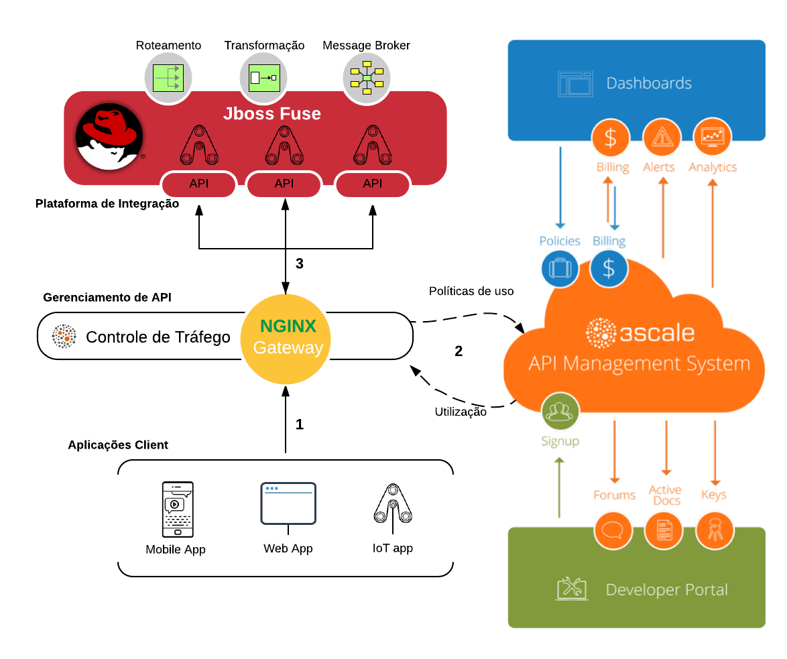

# Red Hat - Workshop ágil de Integração com APIs 

Este é um workshop prático com o objetivo de fornecer uma primeira experiência na construção de um microserviço expondo APIs com o Jboss Fuse Integration Services (FIS) implantar na plataforma do Openshift e mostrar como fazer a gerência e o controle dessas APIs com o Red Hat 3Scale.

O workshop será baseado em laboratórios práticos:

0. [Setup](./lab00/README.md)
1. [Criar um projeto Fuse que obtem registros de um banco de dados](./lab01/README.md)
2. [Expor o acesso a esses registros através de um endpoint REST](./lab02/README.md)
3. [Fazer o deploy desta aplicação no Openshift](./lab03/README.md)
4. [Gerenciar e controlar o acesso a essas APIs através do 3Scale](./lab04/README.md) 

Overview

