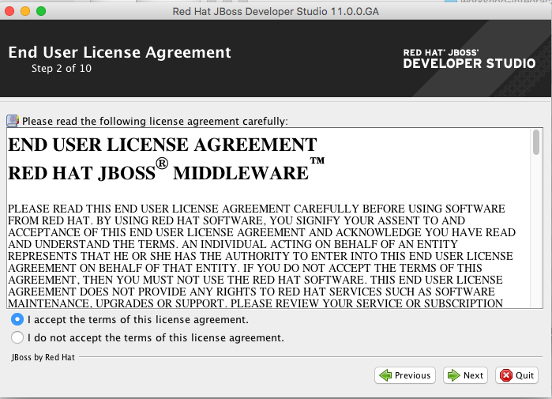
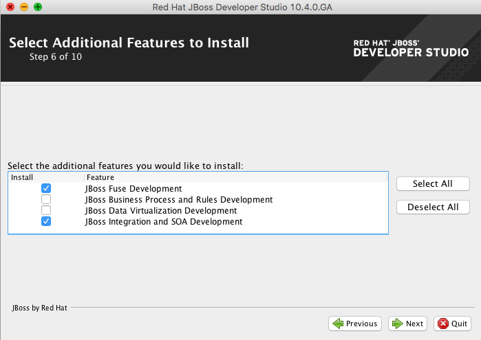
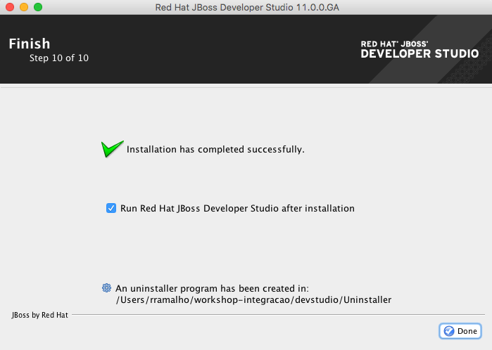

## Setup

Este laboratório tem como objetivo instalar e configurar todos os pré requisitos necessários para este workshop. Assumindo que você já possua o Maven e o Java Development Kit (JDK) devidamente instalados e configurados em seu ambiente. 

Para começarmos pegue o arquivo **workshop-integracao.zip** e faça o unzip na pasta home (opcional) do seu usuário.

### Maven

É necessário configurar os repositórios Maven, neste repositórios estão armazenados todos os artefatos que precisaremos para construir nossas aplicações com o Fuse Integration Services.
Copie o arquivo [settings.xml](https://raw.githubusercontent.com/RedHatBrasil/workshop-integracao/master/lab00/settings.xml) para o diretório **~/.m2/settings.xml** para usuários de Linux ou Mac OS) ou **Documents and Settings\<USER_NAME>/.m2/settings.xml** para usuários Windows.

Neste settings.xml consta configurados os seguintes repositórios:

* Maven central: https://repo1.maven.org/maven2
* Red Hat GA repository: https://maven.repository.redhat.com/ga
* Red Hat EA repository: https://maven.repository.redhat.com/earlyaccess/all

### Jboss Developer Studio

Para instalar o JBoss Developer Studio, basta executar o **devstudio-integration-stack-11.0.0.GA-standalone-installer.jar** em **workshop-integracao/bin** e seguir as instruções abaixo

Substitua o /Users/rramalho para refletir o local onde você fez o unzip **workshop-integracao.zip** no começo deste lab.

Selecione somente as opções
* Jboss Integration and SOA development
* JBoss Fuse Tools

Após a instalação o seu Jboss Developer Studio será iniciado.

Aponte o workspace para o **workshop-integracao/workspace**

Pronto, temos o JBoss Developer Studio instalado e configurado pronto para começarmos a desenvolvedor as aplicações Fuse!

### Openshift client

Escolha o binário compátivel com seu sistema operacional em **workshop-integracao/bin** e faca o unzip. Insira este diretório no PATH do seu sistema operacional

Para testar execute o comando:

	oc version

O output deverá ser semelhante a este:

	oc v3.6.173.0.21
	kubernetes v1.6.1+5115d708d7
	features: Basic-Auth

### Openshift

Utilizaremos um Openshift que já está provisionado, o mesmo poderá ser acessado através da URL: https://console.ocp.rhbrlab.com:8443/console/ com as credenciais fornecidas durante o workshop.

Todo acesso ao cluster será removido no fim do dia.

### 3Scale 

Todos deverão possuir uma conta no [Red Hat 3Scale](https://www.3scale.net), caso não tenha você deverá se cadastrar para uma trial [neste endereço](https://www.3scale.net/signup): https://www.3scale.net/signup

O acesso provido por essa conta trial é suficiente para concluirmos o laboratório 04 sem maiores problemas.

### (OPCIONAL) Openshift local (oc cluster up)

Para quem desejar utilizar o Openshift localmente, você deverá possuir o Docker 1.13 instalado no seu ambiente e posteriormente executar:

	oc cluster up

O único ponto de atenção deve ser no laboratório 04 pois o deployment do gateway deverá utilizar a abordagem híbrida.

Vamos deixar disponível os recursos do FIS no Openshift.

	oc login -u system:admin
	Authentication required for https://10.1.2.2:8443 (openshift)
	Username: admin
	Password:
	Login successful.

Instale o ImageStream e os teamplates para o FIS e o MYSQL

	oc create -f https://raw.githubusercontent.com/jboss-fuse/application-templates/master/fis-image-streams.json -n openshift

	oc create -f https://raw.githubusercontent.com/openshift/origin/master/examples/db-templates/mysql-ephemeral-template.json -n openshift

Faça login como developer, utilizando as credenciais developer/developer (sem privilégios administrativos)

	oc login -u openshift-dev
	Authentication required for https://10.1.2.2:8443 (openshift)
	Username: openshift-dev
	Password:
	Login successful.

