## Lab 01 - Criar um projeto FIS (SpringBoot)

Na IDE Jboss Developer Studio (JBDS), crie um novo projeto utilizando o click direito do mouse no painel project explorer, selecione: **New** -> **Other**

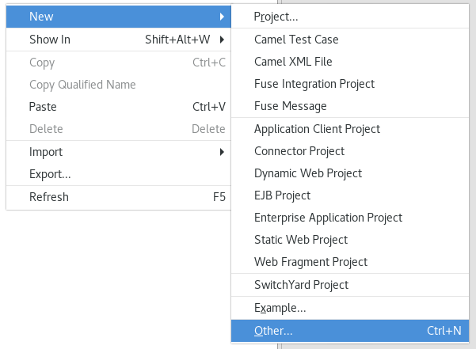

Procure por **Maven** e selecione **Maven Project**

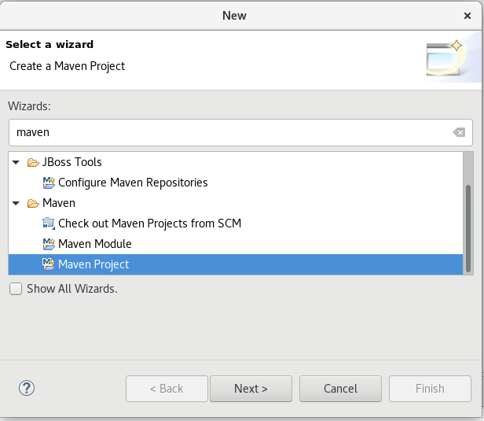

Na proxima tela simplesmente selecione Next.

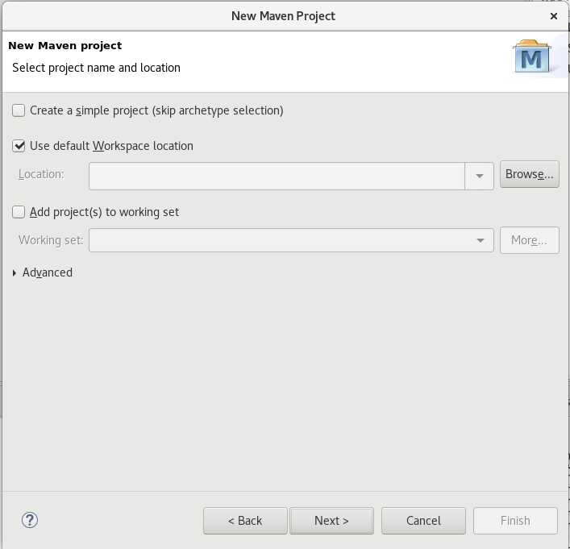

Note que a lista de artifacts pode demorar um pouco a ser exibida uma vez que ela é obtida via internet.

Exibindo a lista de artifacts, filtre por **fis** e selecione a opção **spring-boot-camel-archetype**.

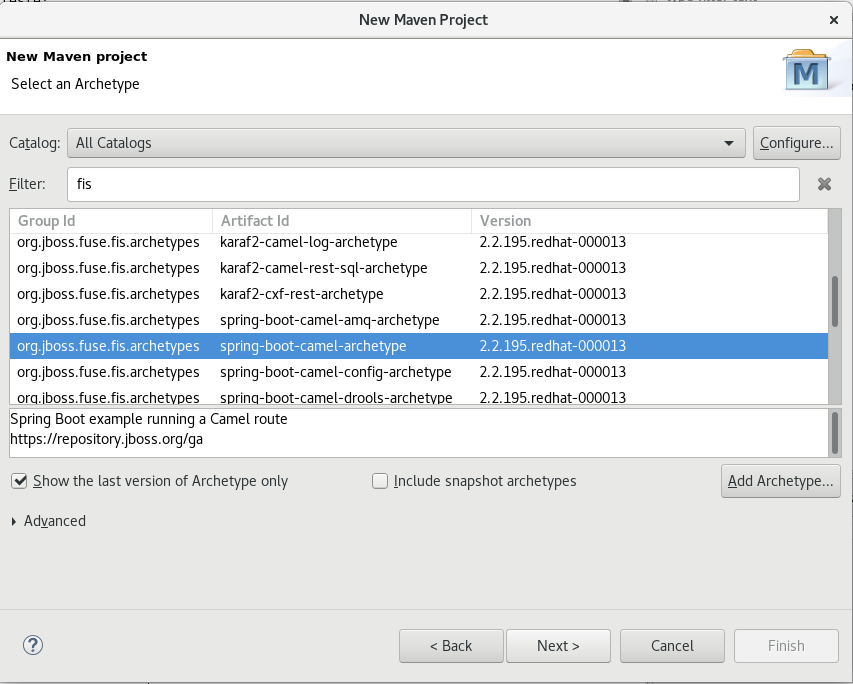

Preencha com os seguintes valores:

	groupId: com.redhat.workshop
	artifactId: customer

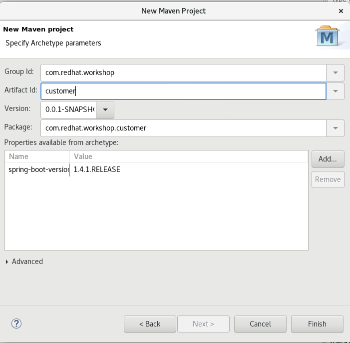

Execute essa rota, através da execução do método main da classe **Application.java**. Clique com o botão direito em cima do método main, **Run As -> Java Application**

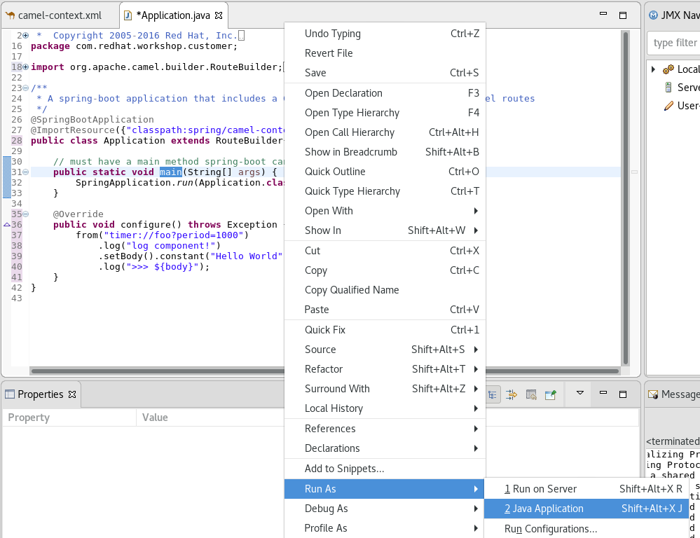

Observe os logs no console...

O Camel permite que você escreva as integrações em XML ou Java. Vamos adicionar um componente de log para mostrar um pouquinho de como é a utilização.

Adicione o componente de log na Rota (Utilize o auto complete) e execute novamente.

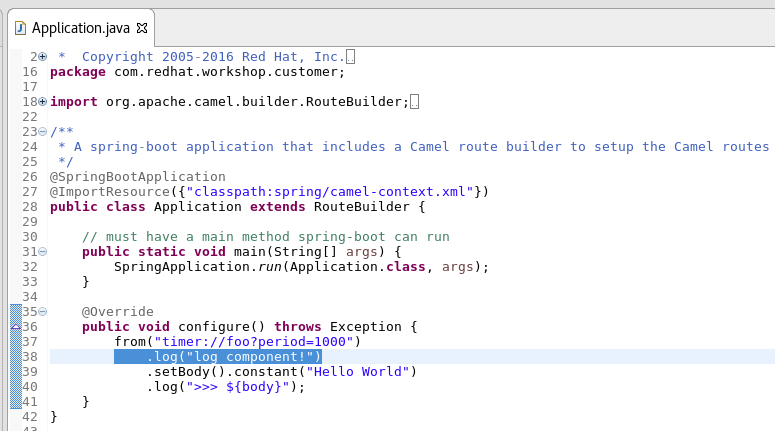

Agora, vamos alterar para o modo XML, para isso iremos comentar o método **configure()** e remover o **extends RouterBuilder** da classe Java.

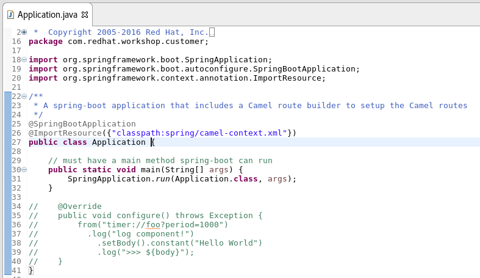

No arquivo camel-context.xml remova os comentários e abra o arquivo novamente, você deverá ver a rota em um formato bem visual

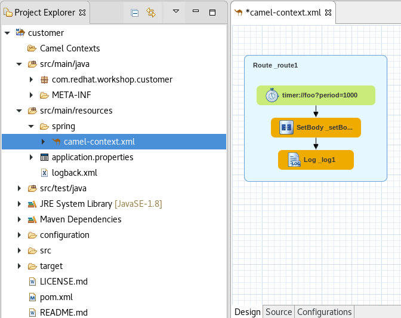

Para adicionar um pouco mais de dinamismo nessa aplicação vamos fazer ela interagir com uma base de dados.

Para o desenvolvimento local vamos utilizar o banco de dados em memória H2. Para isso vamos começar adicionando a dependência no **pom.xml**.

	<dependencies>
	...
		<dependency>
			<groupId>com.h2database</groupId>
			<artifactId>h2</artifactId>
			<scope>runtime</scope>
		</dependency>
		
		<dependency>
			<groupId>org.apache.camel</groupId>
			<artifactId>camel-sql</artifactId>
		</dependency>
	...
	</dependencies>

Agora que a dependência está declarada, podemos iniciar a configuração. Adicione o trecho abaixo nas configurações de datasource no arquivo: **application.properties**

	#Database configuration
	spring.datasource.url = jdbc:h2:mem:mydb;DB_CLOSE_DELAY=-1;DB_CLOSE_ON_EXIT=FALSE
	spring.datasource.username = sa
	spring.datasource.password = 
	spring.datasource.driver-class-name = org.h2.Driver
	spring.datasource.platform = h2

*NOTA: Utilizaremos o banco de dados em memória para testes. E graças ao recurso de autowiring do SpringBoot, este datasource já estará carregado e pronto para uso como datasource padrão no Camel Context.*

Crie um novo arquivo em *src/main/resources*, clicando com o mouse direito no diretório no painel "project explorer" e selecione **New** -> **Others**

Em "Select a wizard", escolha **File** e clique em next, 
em File, insira **schema.sql** como nome para o arquivo, e se certifique que o mesmo estará no diretório *src/main/resources* e selecione "finish".

Adicione o seguinte SQL no arquivo **schema.sql**

	CREATE TABLE customerdemo (
		customerID varchar(10) NOT NULL,
		vipStatus varchar(10) NOT NULL ,
		balance integer NOT NULL
	);

	INSERT INTO customerdemo (customerID,vipStatus,balance) VALUES ('A01','Diamond',1000);
	INSERT INTO customerdemo (customerID,vipStatus,balance) VALUES ('A02','Gold',500);

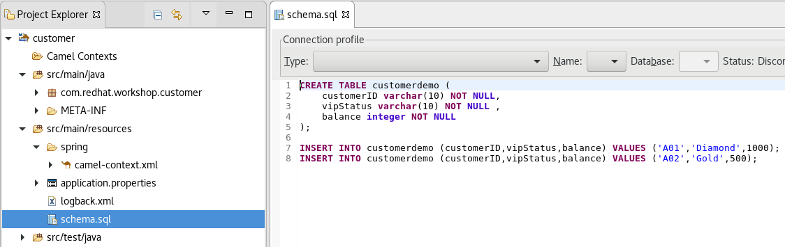

Duplo clique no arquivo **camel-context.xml** em **Camel Contexts**, agora você estará vendo uma rota camel. Remova a rota existente do canvas.

Crie uma nova rota arrastando o componente **ROUTE** da palheta *Routing* no canto direito da tela. Insira o nome **customer** na rota, preenchendo o atributo *ID* na seção de propriedade.

Utilize o componente timer arrastando da palheta de componentes a direita para o canvas. Configure o timer para executar apenas uma vez, em *Properties*-> *Advance* tab -> *Consumer* , insira o valor **1** para o atríbuto **Repeat Count**

Para conseguir ler os dados da fonte de dados (datasource), selecione o componente **SQL** da palheta *Components* no menu lateral direito ao lado da rota. Em *Properties*-> *Advance* tab -> *Path*, preencha o atributo **Query** com **select * from customerdemo** 

Agora na tab *Common* selecione **dataSource** para o atributo **Data Source**

Por último arraste o componente **LOG** da palheta *Components* para o fim da rota. Na tab *Properties*-> *Detail*, atribua **${body}** para  o atributo **Message**.

Caso tenha preferido seguir utilizando a DSL Java, o resultado deve ser o seguinte

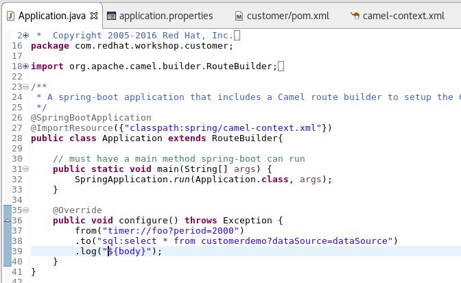

Execute o projeto, para isso pode fazer como mostramos anteriormentes através da execução do método main da classe **Application.java** ou através do **Maven** da seguinte maneira:

Clique direito em **customer** no painel **project explorer**, selecione **Run As..** -> **Maven build...** 

Na janela popup insira **spring-boot:run** em *Goals* e selecione **Skip Tests**.

Agora no console de logs, verifique que os dados do customer estão sendo exibidos

	customer - [{CUSTOMERID=A01, VIPSTATUS=Diamond, BALANCE=1000}, {CUSTOMERID=A02, VIPSTATUS=Gold, BALANCE=500}]

### Método Alternativo de criar um Projeto

Na IDE Jboss Developer Studio (JBDS), crie um novo projeto utilizando o click direito do mouse no painel project explorer, selecione: **New** -> **Fuse Integration Project**

Para o nome do projeto utilize **customer** , e clique em *next*

IMPORTANTE : Selecione a versão **2.18.1.redhat-000015** do Camel !

Em *select target runtime*, clique em *next*

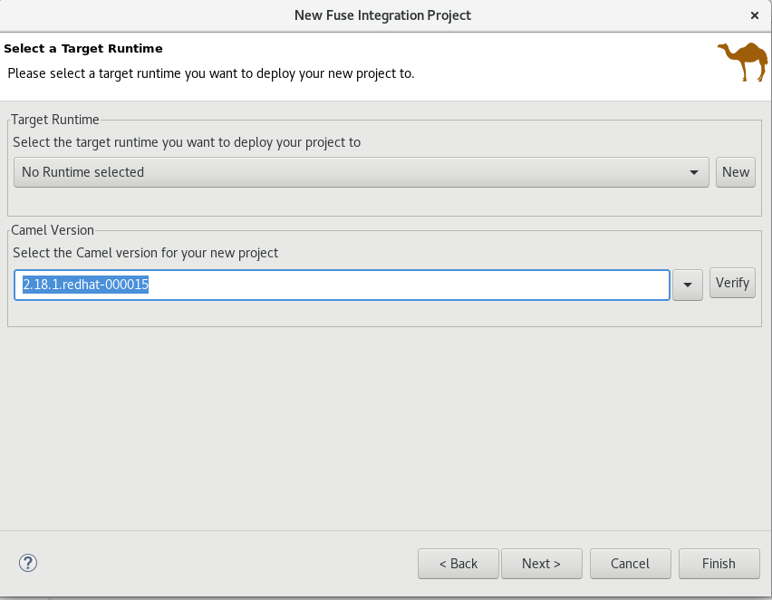

Em *Advance project setup*, escolha **Use a predefined template** e selecione **Fuse on OpenShift** -> **SprintBoot on OpenShift** e clique em *finish*

O JBDS irá perguntar se você quer alterar a perspectiva para Fuse, informe que *sim*.

Antes de continuar, vamos dar uma olhada no que temos até agora. Abra o arquivo *camel-context.xml*, veja que temos uma rota simples com 3 componentes criada.

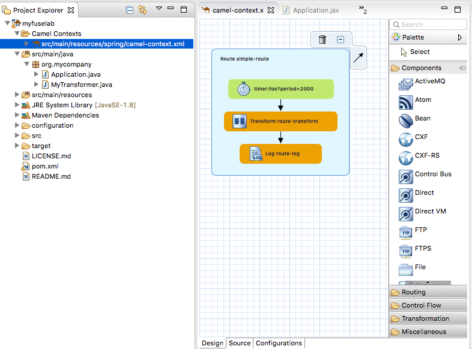

Execute essa rota, através da execução do método main da classe *Application.java*. Clique com o botão direito em cima do método main, *Run As* -> *Java Application*

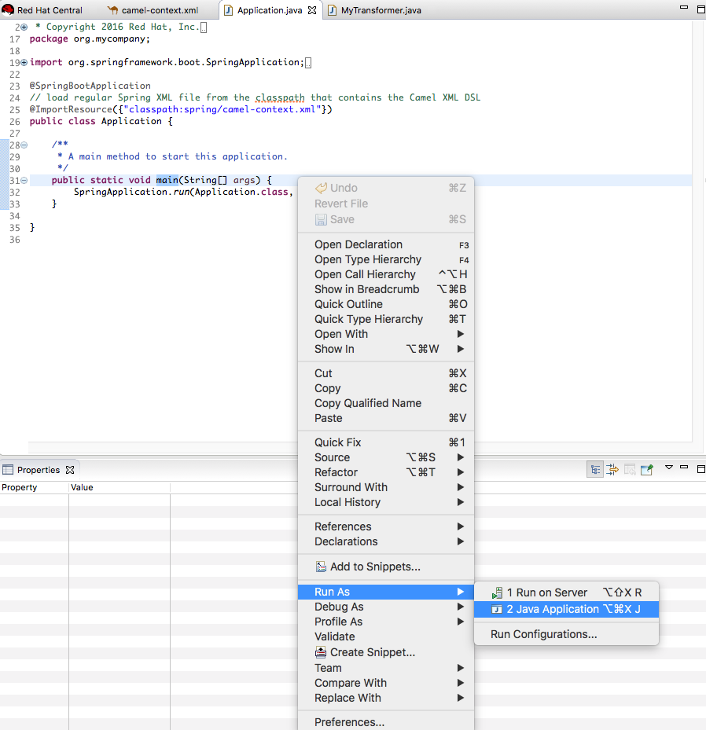