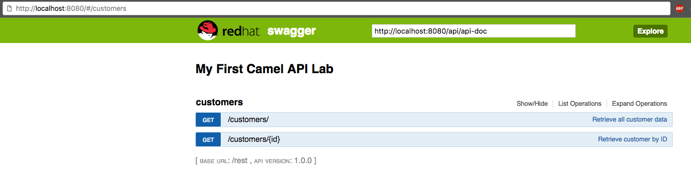

## Lab 02 - Criando APIs

Para expor um endpoint HTTP (API), primeiramente temos que injetar um *Servlet* dentro do *Camel Contexto*.

Antes de adentrarmos, vamos adicionar as dependências necessárias no arquivo **pom.xml** assim podemos focar no desenvolvimento.


    <dependency>
        <groupId>org.apache.camel</groupId>
        <artifactId>camel-servlet-starter</artifactId>
    </dependency>
    <dependency>
        <groupId>org.apache.camel</groupId>
        <artifactId>camel-jackson-starter</artifactId>
    </dependency>
    <dependency>
        <groupId>org.apache.camel</groupId>
        <artifactId>camel-swagger-java-starter</artifactId>
    </dependency>

 Agora precisamos configurar ServletContainer para que possamos trabalhar com as requisições HTTP. Abra o arquivo **camel-context** exibido debaixo da opção **Camel Contexts**, abra a tab *source* e adicione o trecho o seguinte trecho de código antes da tag `<camelContext..>`.

    <bean class="org.apache.camel.component.servlet.CamelHttpTransportServlet" id="camelHttpTransportServlet"/>
    <bean class="org.springframework.boot.web.servlet.ServletRegistrationBean" id="servlet">
        <property name="name" value="CamelServlet"/>
        <property name="servlet" ref="camelHttpTransportServlet"/>
        <property name="urlMappings" value="/api/*"/>
    </bean>

Para configurar a documentação da api (api-doc). No mesmo arquivo agora dentro da tag `<camelcontext..>` e antes da tag `<route...>` adicione o seguinte trecho de código para configurar o endpoint REST. Dessa forma ele estará utilizando Servlet que injetamos no último passo

    <restConfiguration apiContextPath="api-doc" bindingMode="json" component="servlet" contextPath="/api">
        <apiProperty key="cors" value="true"/>
        <apiProperty key="host" value=""/>
        <apiProperty key="api.title" value="My First Camel API Lab"/>
        <apiProperty key="api.version" value="1.0.0"/>
    </restConfiguration>
    <!-- Right above route id="customer" -->    

Terminado o setup das configurações necessárias para se trabalhar com o REST no Camel, podemos definir nossas APIs.

Logo após **restConfiguration** adicione, vamos configurar o path REST **/customers** que ao receber uma requisição **GET** ira direcionar para a rota **direct:getcustomers**.

```
    ...
        <rest path="/customers">
            <get uri="/">
            	<description>Retrieve all customer data</description>
                <to uri="direct:getcustomers"/>
            </get>
        </rest>
    ...
```

Agora invés de chamar um *select* na base de dados através do componente **Timer** como havíamos feito, iremos fazer com que essa interação seja via uma chamada a uma API. Na rota Camel, troque o componente **Timer** pelo componente **Direct**.

Troque

    <from id="time1" uri="timer:timerName?repeatCount=1"/>

por

    <from id="directCustomers" uri="direct:getcustomers"/>

Verifique se seu arquivo **camel-context** está similar ao abaixo:

```
    ...
    <bean class="org.apache.camel.component.servlet.CamelHttpTransportServlet" id="camelHttpTransportServlet" />
	<bean class="org.springframework.boot.web.servlet.ServletRegistrationBean" id="servlet">
		<property name="name" value="CamelServlet" />
		<property name="servlet" ref="camelHttpTransportServlet" />
		<property name="urlMappings" value="/api/*" />
	</bean>

	<!-- Define a traditional camel context here -->
	<camelContext id="camel" xmlns="http://camel.apache.org/schema/spring">

		<restConfiguration apiContextPath="api-doc" bindingMode="json" component="servlet" contextPath="/api">
			<apiProperty key="cors" value="true" />
			<apiProperty key="host" value="" />
			<apiProperty key="api.title" value="My First Camel API Lab" />
			<apiProperty key="api.version" value="1.0.0" />
		</restConfiguration>

		<rest path="/customers">
			<get uri="/">
				<description>Retrieve all customer data</description>
				<to uri="direct:getcustomers" />
			</get>
		</rest>

		<route id="customer">
			<from id="direct1" uri="direct:getcustomers" />
			<to id="toSql" uri="sql:select * from customerdemo?dataSource=dataSource" />
			<log id="toLog" message="${body}" />
		</route>
	</camelContext>
    ...
```

Agora com um click direito no projeto **customer** no painel *project explorer*, selecione **Run As..** -> **Maven build** para inicializar a aplicação novamente. Abra o seu navegador e insira a url

    http://localhost:8080/api/customers

Verifique se o retorno é a lista de *customers* no formato JSON.

    [
        {
            "CUSTOMERID": "A01",
            "VIPSTATUS": "Diamond",
            "BALANCE": 1000
        },
        {
            "CUSTOMERID": "A02",
            "VIPSTATUS": "Gold",
            "BALANCE": 500
        }
    ]

Para verificar a documentação swagger acesse a url

    http://localhost:8080/api/api-doc

Pare a aplicação. 

Caso tenha decidido fazer usando Java DSL.

Crie uma classe chamado RestSetup para fazer a configuração do Servlet e API-DOC.

```
@Component
public class RestSetup extends RouteBuilder{

	@Bean
	ServletRegistrationBean servletRegistrationBean() {
		ServletRegistrationBean servlet = new ServletRegistrationBean(
				new CamelHttpTransportServlet(), "/api/*");
		servlet.setName("CamelServlet");
		return servlet;
	}

	@Override
	public void configure() {
		restConfiguration()
			.contextPath("/api").apiContextPath("/api-doc")
			.host("")
			.apiProperty("api.title", "Order REST API")
			.apiProperty("api.version", "1.0")
			.apiProperty("cors", "true")
			.apiContextRouteId("doc-api")
			.component("servlet")
			.enableCORS(true)
			.bindingMode(RestBindingMode.json);
	}
}
``` 
Define o mapeamento REST na rota

```
@Override
public void configure() throws Exception {
    rest("/customers").description("Customers API")
        .get("/").description("List customers")
            .to("direct:getcustomers");
    
    from("direct:getcustomers")
        .to("sql:select * from customerdemo?dataSource=dataSource")
        .log("${body}");
}
```

## Desafio

Tente adicionar outro REST endpoint que receba como parâmetro o ID do Customer e retorne o Customer com o ID equivalente.

Dicas: 

Rota:

    <get uri="/{id}">

SQL:

    select * from customerdemo where customerID=:#id

Verifique a documentação Swagger e teste as chamadas de API, se certificando que o customer retornado é o A01 no formato JSON.


http://localhost:8080/api/customers/A01

    [
        {
            "CUSTOMERID": "A02",
            "VIPSTATUS": "Gold",
            "BALANCE": 500
        }
    ]
 
## Swagger-ui (Opcional)

Copie o diretório static para **workshop-integracao/workspace/customer/src/main/resources**


