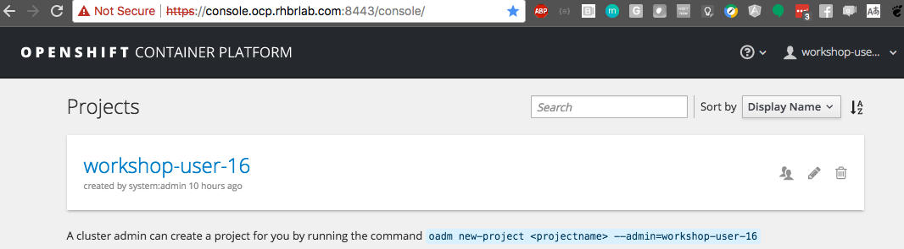

## Lab 03 - Deploy no Openshift


1. Inicialize o seu cluster Openshift através do comando:

    ```
    oc-cluster up integration
    ```

    Você deverá ver mensagens como essa:

    ```
    # Using client for ocp v3.5.5.31
    [INFO] Created self signed certs. You can avoid self signed certificates warnings by trusting this certificate: /home/ec2-user/.oc/certs/master.server.crt
    [INFO] Running a previously created cluster
    oc cluster up --version v3.5.5.31 --image registry.access.redhat.com/openshift3/ose --public-hostname 127.0.0.1 --routing-suffix apps.127.0.0.1.nip.io --host-data-dir /home/ec2-user/.oc/profiles/test/data --host-config-dir /home/ec2-user/.oc/profiles/test/config --host-pv-dir /home/ec2-user/.oc/profiles/test/pv --use-existing-config -e TZ=EDT
    -- Checking OpenShift client ... OK
    -- Checking Docker client ... OK
    -- Checking Docker version ... OK
    -- Checking for existing OpenShift container ... OK
    -- Checking for registry.access.redhat.com/openshift3/ose:v3.5.5.31 image ... OK
    -- Checking Docker daemon configuration ... OK
    -- Checking for available ports ...
       WARNING: Binding DNS on port 8053 instead of 53, which may not be resolvable from all clients.
    -- Checking type of volume mount ...
       Using nsenter mounter for OpenShift volumes
    -- Creating host directories ... OK
    -- Finding server IP ...
       Using 172.31.28.24 as the server IP
    -- Starting OpenShift container ...
       Starting OpenShift using container 'origin'
       Waiting for API server to start listening
       OpenShift server started
    -- Removing temporary directory ... OK
    -- Checking container networking ... OK
    -- Server Information ...
       OpenShift server started.
       The server is accessible via web console at:
           https://127.0.0.1:8443

       You are logged in as:
           User:     developer
           Password: developer

       To login as administrator:
           oc login -u system:admin

    ...

    [INFO] Cluster created sucessfully
    Restarting openshift. Done
    ```

    **Note:** Caso você precise parar o cluster execute o comando `oc-cluster down integration`.


1. Adicione os imagestreams e templates do `mysql-ephemeral` e `FIS`

   FIS images
   ```
   oc create -f https://raw.githubusercontent.com/jboss-fuse/application-templates/master/fis-image-streams.json -n openshift --as=system:admin
   ```

   MYSQL Database
   ```
   oc create -f https://raw.githubusercontent.com/openshift/origin/master/examples/db-templates/mysql-ephemeral-template.json -n openshift --as=system:admin
   ```

You can try view the OpenShift console by going to https://127.0.0.1:8443/console in the browser. 



Agora que temos o Openshift em execução não precisamos continuar testando nossa aplicação com o banco de dados em memória H2, agora podemos executar com uma base de dados real para isso utilizaremos o MYSQL. Adicione o seguinte trecho de código no arquivo **application.properties** que se encontra no diretório *src/main/resources*.

```
#mysql specific
mysql.service.name=mysql
mysql.service.database=sampledb
mysql.service.username=dbuser
mysql.service.password=password

#Database configuration
spring.datasource.url = jdbc:mysql://${${mysql.service.name}.service.host}:${${mysql.service.name}.service.port}/${mysql.service.database}
spring.datasource.username = ${mysql.service.username}
spring.datasource.password = ${mysql.service.password}
```

Como estamos utilizando o banco de dados MYSQL, iremos adicionar o driver como dependência no arquivo **pom.xml**

```
<dependency>
      <groupId>org.springframework.boot</groupId>
      <artifactId>spring-boot-starter-jdbc</artifactId>
</dependency>
<dependency>
      <groupId>mysql</groupId>
      <artifactId>mysql-connector-java</artifactId>
      <scope>runtime</scope>
</dependency>
```

Abra o **Openshift Explorer View**, no menu do topo selecione **Window -> Show view -> others**. Uma janela irá aparecer, digite openshift no campo de busca e selecione **Openshift Explorer**


No **Openshift Explorer**, clique com o direito em **connection** e crie um novo projeto **NEW** -> **Project**


**Note:** 'Caso não tenha criado a conexão anteriormente

1. Clique em **New Connection Wizard...** Para configurar o Openshift. Em **Server** Insira a URL do console web Openshift (https://127.0.0.1:8443) e clique em  **retrieve** para obter o token de acesso.
1. Nova nova janela faça login como desenvolvedor usando as credenciais developer/developer.

    

1. Clique em **Close**
1. **DESMARQUE** o botão *Save token* e clique em **Finish**

    

Então crie um projeto com o nome **myfuseproject** com o Display Name **My Fuse Project**


Dentro do projeto primeiramente nós iremos criar um banco de dados MYSQL para nossa aplicação. Clique direito no projeto **myfuseproject** e então **New** -> **Application**


Na aba **Server application source**, selecione  **mysql-ephemeral(database, mysql) - openshift** eclique em next.


Se certifique de utilizar os seguintes parâmetros

```
MYSQL_PASSWORD = password
MYSQL_USER = dbuser
```


Clique em Finish, e agora você deve ver uma instância do MYSQL em execução no **Openshift Explorer**.


Agora nós podemos finalmente fazer o deploy da nossa aplicação no Openshift, clicando com o botão direito no projeto e selecionando **Run As** -> **Run Configurations...**


No menu popup, selecione **Deploy myfuselab on Openshift** no painel da esquerda. Agora vá na aba **JRE** e em **VM arguments**, atualize a variávels kubernetes.master com o o endereço do seu openshift **https://127.0.0.1:8443** e kubernetes.namespace com **myfuseproject**  e finalmente usuário/senha com developer/developer e clique em **RUN**.


Para ver tudo em execução, abra o seu navegador em *https://127.0.0.1:8443/console/* faça o login com as credenciais developer/developer, selecione o projeto **MY Fuse Project**. E você verá as duas aplicações em execução na aba Overview.


Para que essa aplicação possa ser acessada por uma URL externa, é necessário ir em **Application** -> **Service** no menu da esquerda e clique em **camel-ose-springboot-xml**.


Clique em **Create route**.


Não altere nada e clique em **Create**.

Acesse a API que criamos através do seguinte endereço

```
curl http://myfuseproject-camel-ose-springboot-xml.127.0.0.1.nip.io/myfuselab/customer/all
curl  http://myfuseproject-camel-ose-springboot-xml.127.0.0.1.nip.io/myfuselab/customer/A01
```

Verifique se está retornando o customer no formato JSON, como mostrado abaixo

```
[{"CUSTOMERID":"A01","VIPSTATUS":"Diamond","BALANCE":1000},{"CUSTOMERID":"A02","VIPSTATUS":"Gold","BALANCE":500}]

[{"CUSTOMERID":"A01","VIPSTATUS":"Diamond","BALANCE":1000}]
```

Para verificar a sua rota Camel em ação, no seu console Openshift, vá em **Application** -> **pod** e selecione o pod **camel-ose-springboot-xml-1-xxxxx**


Clique em **Open Java Console**, isso te levará para um console individual que mostra o que a sua rota Camel está fazendo


Clique em **Route Diagram** e execute as APIs algumas vezes para ver o que acontece


Para aqueles que querem ver o que está acontecendo no banco de dados, logue na base de dados MYSQL através da linha de comando e execute

```
oc project myfuseproject

oc get pods
NAME                                   READY     STATUS    RESTARTS   AGE
camel-ose-springboot-xml-s2i-1-build   1/1       Running   0          15s
mysql-1-xxxxx                          1/1       Running   0          2m

oc rsh mysql-1-xxxxx

sh-4.2$ mysql -udbuser -p sampledb
Enter password:

mysql> select * from customerdemo;
+------------+-----------+---------+
| customerID | vipStatus | balance |
+------------+-----------+---------+
| A01        | Diamond   |    1000 |
| A02        | Gold      |     500 |
+------------+-----------+---------+
2 rows in set (0.00 sec)
```
