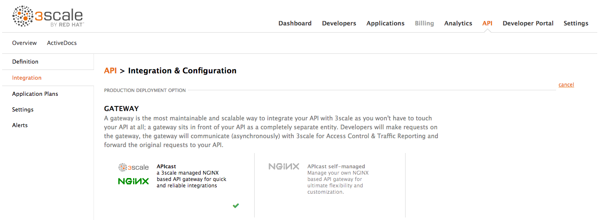
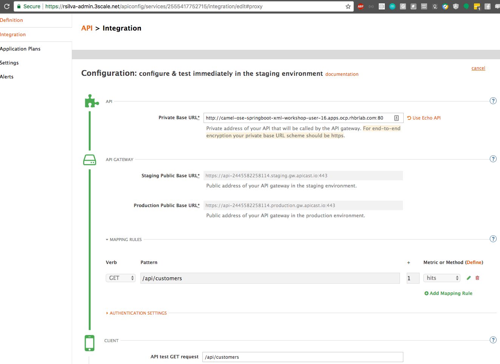

## Lab 04 - Gerenciamento de APIs

### Conectando a API Customers ao Red Hat 3Scale

Para isso precisamos seguir 3 passos:

1. Acesse o 3scale Admin Portal e crie o seu primeiro serviço
1. Customize o Developer Portal
1. Integre a sua API com o 3Scale usando o API Gateway

### Step 0: Pré reqs

Antes de provisionar o API gateway on-premise, você deverá verificar o seguinte na sua conta 3Scale.

1. 3scale Domain
    * Você precisa saber qual é o domínio da sua conta 3Scale SaaS.

    * O 3Scale domain é referenciado na URL do seu portal administrativo do 3Scale SaaS, ex:  ie: https://&lt;YOURDOMAIN&gt;-admin.3scale.net/p/admin/dashboard.
    
### Passo 1: Defina sua API

1. Login no portal de administração http://&lt;YOURDOMAIN&gt;-admin.3scale.net

    

2. Caso seja a primeira vez que você acessa o portal 3scale, clique em *activate* da sua caixa de email, agora feche o wizard clicando no **X** na parte superior na direita da sua tela

    

3. A primeira página que você verá é a página de API. Daqui podemos criar a nossa API. Clique no link `Integration`

    

4. Clique em `edit integration settings` para editar as configurações da API para o gateway

    

5. Selecione a opção **APIcast self-managed** como opção para deploy do Gateway.

    

6. Mantenha **API Key (user_key)** Authentication

    

7. Clique em **Update Service**

8. Clique no botão **add the Base URL of your API and save the configuration**

9. Expanda a seção **mapping rules** que define os métodos (HTTP) que serão expostos por essa API

    > **Nota:** O mapeamento padrão é root ("/") of our API resources, something that we might want to avoid.

    

10. Clique em **Metric or Method (Define)** 

    

11. Clique em **New Method** na seção *Methods*

    

12. Preencha as informações

    **Friendly name:** `Get Customers`

    **System name:** `customers_all`

    **Description:** `Method to return all customers`

    

13. Clique em **Create Method**

14. **Optional:** Adicione o método `Get Customer` caso você tenha feito as intruções para implementar a busca do customer por `{id}`. Então nomeie para `customer_get`

15. Clique em **Add mapping rule** 

    

16. Clique para editar este mapping rule

    

17. Insira `/myfuselab/customer/all` para o Pattern

18. Selecione `customers_all` como Method

    

19. *Optional::* Clique no botão **Add Mapping Rule** para adicionar o `customer_get` como method mapping.

20. Preencha as informações para acessar sua API:

    **Private Base URL:** `http://camel-ose-springboot-xml:80`

    **Staging Public Base URL:** `http://customer-api-staging.127.0.0.1.nip.io:80`

    **Production Public Base URL:** `http://customer-api-production.127.0.0.1.nip.io:80`

    

    > **Note:** Nós estamos utilizando um serviço de API interno porque estamos utilizando tudo dentro do mesmo cluster Openshift

21. Mais abaixo clique em **API Test GET request**

22. Informe `/myfuselab/customer/all`

23. Clique em **Update the Staging Environment** para salvar as alterações e clique em **Back to Integration & Configuration** para voltar para página das integrações

    

24. Clique no botão **Promote v.1 to Production** para promover suas configurações de homologação para produção

    

25. Pronto! Agora a sua camada de gerenciamento de API só irá permitir que chamadas autenticadas cheguem até o seu backend de APIs (Fuse).

### Passo 3: Registre uma nova conta no Developer Portal 

The focal point of your developers’ experience is the API developer portal, and the level of effort you put into it will determine the level of decreased support costs and increased developer engagement. 3scale provides a built-in, state-of-the-art CMS portal, making it very easy to create your own branded hub with a custom domain to manage developer interactions and increase API adoption.

You can customize the look and feel of the entire Developer Portal to match your own branding. You have complete control over every element of the portal, so you can make it as easy as possible for developers to learn how to use your API.

The Developer Portal's CMS consists of a few elements:
* Horizontal menu in the Admin Portal with access to content, redirects, and changes
* The main area containing details of the sections above
* CMS mode, accessible through the preview option


Liquid is a simple programming language used for displaying and processing most of the data from the 3scale system available for API providers. In the 3scale platform, it is used to expose server-side data to your API developers, greatly extending the usefulness of the CMS while maintaining a high level of security.

1. Click on the `Developer Portal` tab to access the developer portal settings.

    

1. Click on the `Visit Developer Portal` to take a look of how your developer portal looks like.

    

    You can see there is a default portal with information of your API and how to signup. Unfortunately the API information is incorrect.

    

    > **Note:** We will edit our portal to update it with the correct information and to add the shadowman cool logo.

1. Go back to your admin portal browser tab and search the content sub-sections for the `Layouts `and select the `</> Main layout`

    

1. First look for the `navbar` section of the main HTML. Replace the `{{ provider.name }}` for the shadowman image link:

    ``

    

1. Click on `Publish` button at the bottom of the editor to save the changes and made them available in the site.

    

1. Go back to browse the top of the content sub-sections and find the `Homepage` section.

    

1. Change all the code `Echo` references in the homepage code for `Customer`.

1. Update the API call examples to reflect your real Fuse API calls.

    > **Note:** Use your production base url and add your defined methods. Dont worry if you don't have the "real" output, it won't affect the rest of the lab.

1. Refresh your Developer Portal's browser tab to check the changes. Your Developer Portal should look like this:

    

1. Take the place of one of your developers and signup for the **Basic** plan.

    

1. Fill in your information and your email to register as a developer. Click on the `Sign up` button.

    

    > **Note:** Use an email address you can actually access.

1. Check your email and click on the `activate` link.

    

1. As your portal is not currently public, you will need your portal code to finish the registration. You can get the code in your admin portal navigating to: `Settings > Developer Portal > Domains & Access`.

    

1. Type your portal code to finish the account activation.

    

1. Now that your developer account is active, sign in the portal.

    

1. You will land in the developers homepage, where you will be able to check your developers settings and retrieve your `User Key`.

    

    > **Note:** Copy down this key as it is used to authenticate yourself to the managed API.


### Step 4: Test APIcast

1. Test that APIcast authorizes a valid call to your API, by executing a curl command with your valid developer's `user_key` to the `hostname` that you configured in the previous step:

    ```
    curl -i "http://customer-api-production.<OPENSHIFT-SERVER-IP>.nip.io:80/myfuselab/customer/all?user_key=YOUR_USER_KEY" --insecure
    ```
    You should see the following messages:

    ```
    HTTP/1.1 200 OK
    Server: openresty/1.11.2.2
    Date: Tue, 30 May 2017 20:13:33 GMT
    Content-Type: application/json
    Transfer-Encoding: chunked
    X-Application-Context: application:dev
    accept: */*
    breadcrumbId: ID-traveler-laptop-rh-mx-redhat-com-45222-1496169770755-0-16
    forwarded: for=192.168.42.1;host=customer-api-staging.192.168.42.100.nip.io;proto=http
    user-agent: curl/7.29.0
    user_key: c13de99abb137810df23ce011d2a948a
    x-3scale-proxy-secret-token: Shared_secret_sent_from_proxy_to_API_backend_71cfe31d89d8cf53
    x-forwarded-for: 192.168.42.1
    x-forwarded-host: customer-api-staging.192.168.42.100.nip.io
    x-forwarded-port: 80
    x-forwarded-proto: http
    x-real-ip: 172.17.0.1
    Set-Cookie: e286b151c44656235d8bdca6ee183477=e58d9930d57779957bf1695b6c805dcd; path=/; HttpOnly
    Cache-control: private

    [{"CUSTOMERID":"A01","VIPSTATUS":"Diamond","BALANCE":1000},{"CUSTOMERID":"A02","VIPSTATUS":"Gold","BALANCE":500}]
    ```

    The last line is the same output as when calling the API directly.

2. Test that APIcast does not authorize an invalid call to your API.

    ```
    curl -i "http://customer-api-production.<OPENSHIFT-SERVER-IP>.nip.io:80/myfuselab/customer/all?user_key=INVALID_KEY" --insecure
    ```

    When calling the API endpoint with an invalid key, the following messages appear:

    ```
    HTTP/1.1 403 Forbidden
    Server: openresty/1.11.2.2
    Date: Tue, 30 May 2017 20:17:19 GMT
    Content-Type: text/plain; charset=us-ascii
    Transfer-Encoding: chunked
    Set-Cookie: e286b151c44656235d8bdca6ee183477=e58d9930d57779957bf1695b6c805dcd; path=/; HttpOnly
    ```

    The *HTTP/1.1 403 Forbidden* response code indicates that our user_key was wrong or we don't have permisson to access this API endpoint.

3. You have sucessfully configured 3scale API Management and Gateway to access your API.
